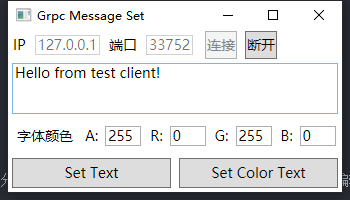
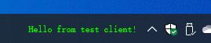

# DeskBandServer

#### 介绍
  DeskBand Server base on grpc  
  基于Grpc协议的DeskBand服务

#### 软件架构
1.  软件架构说明基于CSDeskBand.Wpf实现的DeskBand服务程序
2.  通过regasm.exe 将dll注册到资源管理器进程的到COM容器中
3.  通过grpc协议接口设置DeskBand区域内显示的文字

#### 安装教程

1.  任务栏右键-解锁任务栏
2.  以管理员身份执行Reg.bat
3.  对话提示框选择"是"

4.  将DeskBand从任务栏拖出来

5.  任务栏右键-锁定任务栏（可选）

#### 使用说明

1.  首次运行后将在dll目录自动生成SysConfig.json(程序参数设置), GrpcConfig.json(Grpc消息服务相关设置), StyleConfig.json(部分样式设置),可手动编辑修改相关值，修改在下次启动时生效。
2.  通过Grpc协议ShowTextMessage接口设置显示文字(可参照[demo](demo/))
##### demo效果

  设置界面  
  

  设置文字  
  

  设置彩色文字  
  

#### 参与贡献

1.  DeskBand的实现基于 [CSDeskBand](https://github.com/dsafa/CSDeskBand)
